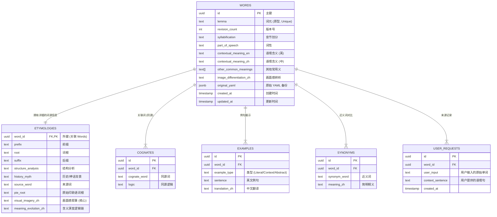

# Etymos Manager (Ad Fontes Manager)

**Etymos Manager** 是 **Ad Fontes** 英语学习生态系统中的核心管理组件。该生态致力于通过“回到源头”的方式（词源、动作还原）帮助学习者建立对语言的深度体感。

## 📚 Ad Fontes 系列项目

本工具是 Ad Fontes 三部曲中的 **"The Manager"**，请配合以下项目使用以获得完整体验：

1.  **[Ad Fontes Prompts](https://github.com/yelanyanyu/ad-fontes-prompts)** (The Soul)
    *   **核心提示词库**：提供用于 ChatGPT/Claude 的核心 Prompt，将单词还原为动作和画面。
2.  **[Ad Fontes Browser Extension](https://github.com/yelanyanyu/ad-fontes-browser-extension)** (The Helper)
    *   **浏览器插件**：辅助生成结构化单词卡，支持一键提取词根、释义并格式化为 YAML。
3.  **[Ad Fontes Manager](https://github.com/yelanyanyu/ad-fontes-manager)** (The Manager - 本项目)
    *   **数据管理器**：全栈 Web 应用，用于管理、可视化、存储和复习你的词源数据。支持离线优先、冲突同步和精美卡片预览。

---

这是一个全栈 Web 应用程序，专为管理、可视化和存储从 YAML 解析出的词源数据而设计。

## 快速开始（Windows）
- 启动（开发模式，推荐）：双击 [start_tool_yml2pg.bat](file:///d:/myCode/formal-projects/ad-fontes-manager/start_tool_yml2pg.bat)（会自动安装依赖并启动 API+前端）
  - 前端：`http://localhost:<CLIENT_DEV_PORT>`（默认见 [web/config.json](file:///d:/myCode/formal-projects/ad-fontes-manager/web/config.json)）
  - API：`http://localhost:<API_PORT>/api`（默认见 [web/config.json](file:///d:/myCode/formal-projects/ad-fontes-manager/web/config.json)）
- 启动（生产模式）：`start_tool_yml2pg.bat prod`
  - 服务：`http://localhost:<API_PORT>`
- 停止：双击 [stop_tool_yml2pg.bat](file:///d:/myCode/formal-projects/ad-fontes-manager/stop_tool_yml2pg.bat)（按端口精准停止，不会误杀其他 node 进程）

## 手动启动（开发者）
### 依赖
- Node.js + npm
- PostgreSQL（可选：离线模式只写本地缓存，不需要数据库）

### 安装与运行（开发模式）
```bash
cd web
npm install
cd client
npm install
cd ..
npm run dev
```
打开：`http://localhost:<CLIENT_DEV_PORT>`

### 构建与运行（生产模式）
```bash
cd web
npm install
cd client
npm install
cd ..
npm run build
set NODE_ENV=production
node server.js
```
打开：`http://localhost:<API_PORT>`

## 配置与本地数据位置
- 本地离线缓存：`web/data/local_words.json`（建议不提交到 git）
- 本地配置：`web/config.json`（建议不提交到 git，可在 Settings 页面保存配置）
  - `API_PORT`：后端服务端口（默认写在配置文件）
  - `CLIENT_DEV_PORT`：前端开发端口（默认写在配置文件）
  - `DB_PORT`：数据库端口（仅在未设置 DATABASE_URL 时用于拼接连接串）

## 🌟 核心特性 (v1.2+)

### 1. 离线优先架构 (Offline-First)
*   **双重存储**：利用浏览器的 LocalStorage 实现无缝离线运行。
*   **同步引擎**：强大的同步逻辑，支持：
    *   **离线 -> 在线**：当连接到数据库时，批量上传本地记录。
    *   **冲突检测**：自动识别双端都被修改过的记录。
    *   **Diff 界面**：可视化的差异对比工具，用于解决冲突（覆盖或保留）。
    *   **覆盖同步后编辑器刷新**：冲突覆盖成功后，编辑器内容会同步更新为最新数据。
    *   **编辑加载最新数据**：打开数据库词条时会优先拉取最新 YAML。
    *   **强制覆盖写入**：执行覆盖时会写入最新 YAML 并更新关联数据。

### 2. 现代 Web 界面
*   **搜索与排序**：支持模糊搜索（部分匹配）和多种排序方式（A-Z、日期）。
*   **分页功能**：客户端分页，支持自定义每页显示数量。
*   **编辑器**：集成 YAML 编辑器，支持实时预览和格式验证。
*   **技术栈**：
    *   **无框架**：使用原生 JavaScript 构建，采用 **ES Modules** 实现模块化。
    *   **样式**：使用 Tailwind CSS (CDN) 并提取了自定义 CSS。
    *   **状态管理**：中心化的 `state.js` 存储模式（类 Redux 风格）。

---

## 🗄️ 数据库 Schema 设计

本文档概述了用于存储从 YAML 解析出的复杂词源数据的数据库 Schema 设计。

### 实体关系图 (Mermaid)



### 设计亮点

1.  **规范化策略 (Normalization Strategy)**：
    *   **1:1 分离**：将 `Etymologies`（词源信息）与 `Words`（单词基本信息）分离，保持主表轻量高效，便于列表展示和搜索，同时将重文本内容（如画面感叙事）隔离在专用表中。
    *   **1:N 关系**：`Cognates`（同源词）、`Examples`（例句）和 `Synonyms`（近义词）被完全规范化为子表，以支持任意数量的条目，无需修改 Schema。

2.  **PostgreSQL 优化**：
    *   **UUID 主键**：所有表均使用 `UUID` 作为主键 (`gen_random_uuid()`)，支持分布式架构和更安全的数据合并。
    *   **JSONB 审计**：`words.original_yaml` 列存储原始输入数据。这种“读时模式 (Schema-on-Read)”备份允许我们在逻辑变更时重新解析数据，而不会丢失原始来源。
    *   **GIN 索引**：在 `original_yaml`（用于任意 JSON 查询）和 `pie_root`（用于词根文本搜索）上启用了 GIN 索引。

3.  **安全性**：
    *   **行级安全性 (RLS)**：在所有表上启用。目前配置为默认的“公开读写”策略，但已为未来的多租户隔离（例如 `auth.uid() = user_id`）做好准备。

```
ad-fontes-manager
├─ CHANGELOG.md
├─ DEVELOPMENT.md
├─ init_db.js
├─ migration_v2.sql
├─ node
│  ├─ init_db.js
│  ├─ loader.js
│  ├─ migrate_v2.js
│  ├─ package-lock.json
│  └─ package.json
├─ README.md
├─ schema.sql
└─ web
   ├─ .dockerignore
   ├─ client
   │  ├─ index.html
   │  ├─ package-lock.json
   │  ├─ package.json
   │  ├─ postcss.config.js
   │  ├─ public
   │  │  ├─ logo.svg
   │  │  └─ vite.svg
   │  ├─ README.md
   │  ├─ src
   │  │  ├─ App.vue
   │  │  ├─ assets
   │  │  │  └─ main.css
   │  │  ├─ components
   │  │  │  ├─ Layout
   │  │  │  │  ├─ Header.vue
   │  │  │  │  └─ Sidebar.vue
   │  │  │  ├─ ui
   │  │  │  │  ├─ ConflictModal.vue
   │  │  │  │  └─ ToastContainer.vue
   │  │  │  ├─ WordEditor
   │  │  │  │  └─ WordEditor.vue
   │  │  │  ├─ WordList
   │  │  │  │  └─ WordList.vue
   │  │  │  └─ WordPreview
   │  │  │     └─ WordPreview.vue
   │  │  ├─ main.js
   │  │  ├─ router
   │  │  │  └─ index.js
   │  │  ├─ stores
   │  │  │  ├─ appStore.js
   │  │  │  └─ wordStore.js
   │  │  ├─ style.css
   │  │  ├─ utils
   │  │  │  ├─ conflict.js
   │  │  │  ├─ generator.js
   │  │  │  ├─ request.js
   │  │  │  └─ template.js
   │  │  └─ views
   │  │     ├─ EditorView.vue
   │  │     ├─ HomeView.vue
   │  │     └─ SettingsView.vue
   │  ├─ tailwind.config.js
   │  └─ vite.config.js
   ├─ controllers
   │  └─ wordController.js
   ├─ data
   ├─ db
   │  └─ index.js
   ├─ Dockerfile
   ├─ localStore.js
   ├─ package-lock.json
   ├─ package.json
   ├─ routes
   │  ├─ core.js
   │  ├─ sync.js
   │  └─ words.js
   ├─ scripts
   │  ├─ test-api-sorting.mjs
   │  └─ test-list-sort.mjs
   ├─ server.js
   └─ services
      ├─ conflictService.js
      └─ wordService.js

```
