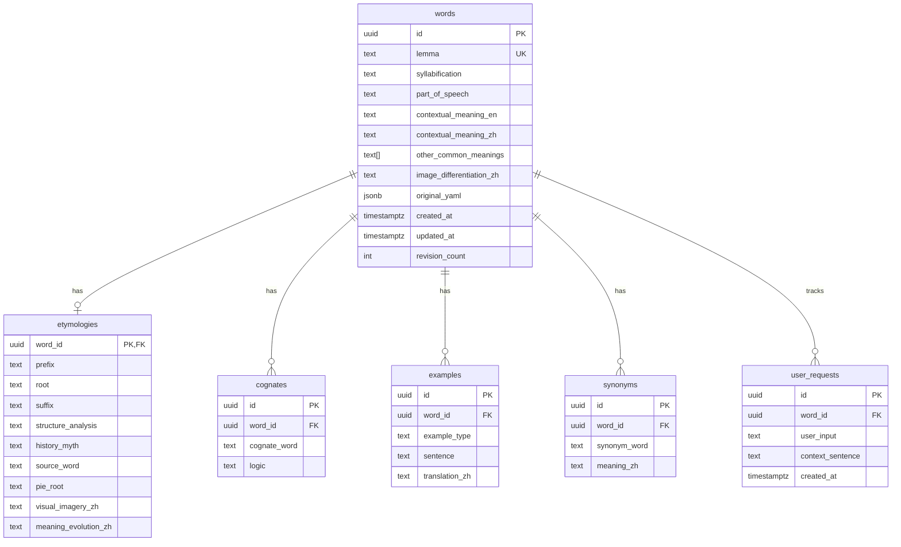

# Database Schema Documentation

> **Database:** PostgreSQL 14+  
> **Last Updated:** 2026-03-05

## Overview

This document describes the database schema for the Ad Fontes Manager application.

## Entity Relationship Diagram

## Tables

### words

Core entity storing vocabulary lemma and contextual definitions.

| Column | Type | Nullable | Default | Description |
|--------|------|----------|---------|-------------|
| `id` | UUID | NO | `gen_random_uuid()` | Primary key |
| `lemma` | TEXT | NO | - | Canonical form (e.g., "run" for "running"). **Unique** |
| `syllabification` | TEXT | YES | - | Phonetic syllable division (e.g., "dig-ni-ty") |
| `part_of_speech` | TEXT | YES | - | Part of speech (e.g., "noun", "verb") |
| `contextual_meaning_en` | TEXT | YES | - | Contextual meaning in English |
| `contextual_meaning_zh` | TEXT | YES | - | Contextual meaning in Chinese |
| `other_common_meanings` | TEXT[] | YES | - | Array of other common definitions |
| `image_differentiation_zh` | TEXT | YES | - | Visual differentiation description in Chinese |
| `original_yaml` | JSONB | YES | - | Full backup of original YAML for debugging |
| `created_at` | TIMESTAMPTZ | NO | `now()` | Creation timestamp |
| `updated_at` | TIMESTAMPTZ | NO | `now()` | Last update timestamp |
| `revision_count` | INTEGER | YES | `1` | Number of times this word has been updated |

**Indexes:**
- `idx_words_lemma` on `lemma`
- `idx_words_original_yaml` (GIN index on JSONB)

---

### etymologies

Deep etymological analysis. 1:1 relationship with `words`.

| Column | Type | Nullable | Description |
|--------|------|----------|-------------|
| `word_id` | UUID | NO | Primary key, foreign key to `words.id` |
| `prefix` | TEXT | YES | Prefix analysis (e.g., "re-", "un-") |
| `root` | TEXT | YES | Root word (e.g., "-dign-") |
| `suffix` | TEXT | YES | Suffix analysis (e.g., "-ity", "-tion") |
| `structure_analysis` | TEXT | YES | Explanation of word structure |
| `history_myth` | TEXT | YES | Historical or mythological background |
| `source_word` | TEXT | YES | Source word (e.g., Latin origin) |
| `pie_root` | TEXT | YES | Proto-Indo-European root (e.g., "*dek-") |
| `visual_imagery_zh` | TEXT | YES | Visual imagery narrative in Chinese |
| `meaning_evolution_zh` | TEXT | YES | Meaning evolution description in Chinese |

**Indexes:**
- `idx_etymologies_pie_root_search` (GIN full-text search on `pie_root`)

---

### cognates

Words sharing the same etymological root. 1:N relationship with `words`.

| Column | Type | Nullable | Description |
|--------|------|----------|-------------|
| `id` | UUID | NO | Primary key |
| `word_id` | UUID | NO | Foreign key to `words.id` |
| `cognate_word` | TEXT | NO | The related cognate word |
| `logic` | TEXT | NO | Explanation of etymological connection |

**Constraints:**
- Unique constraint on `(word_id, cognate_word)`

**Indexes:**
- `idx_cognates_word_id` on `word_id`

---

### examples

Usage examples categorized by type. 1:N relationship with `words`.

| Column | Type | Nullable | Description |
|--------|------|----------|-------------|
| `id` | UUID | NO | Primary key |
| `word_id` | UUID | NO | Foreign key to `words.id` |
| `example_type` | TEXT | YES | Type: "Literal", "Current Context", "Abstract" |
| `sentence` | TEXT | NO | Example sentence in English |
| `translation_zh` | TEXT | YES | Chinese translation |

**Indexes:**
- `idx_examples_word_id` on `word_id`

---

### synonyms

Synonyms with nuanced meaning comparisons. 1:N relationship with `words`.

| Column | Type | Nullable | Description |
|--------|------|----------|-------------|
| `id` | UUID | NO | Primary key |
| `word_id` | UUID | NO | Foreign key to `words.id` |
| `synonym_word` | TEXT | NO | The synonym word |
| `meaning_zh` | TEXT | YES | Brief Chinese definition |

**Indexes:**
- `idx_synonyms_word_id` on `word_id`

---

### user_requests

User query history. Stores user input and context for analytics.

| Column | Type | Nullable | Default | Description |
|--------|------|----------|---------|-------------|
| `id` | UUID | NO | `gen_random_uuid()` | Primary key |
| `word_id` | UUID | NO | - | Foreign key to `words.id` |
| `user_input` | TEXT | YES | - | The exact word form entered by user |
| `context_sentence` | TEXT | YES | - | Context sentence provided by user |
| `created_at` | TIMESTAMPTZ | NO | `now()` | Query timestamp |

---

## Security

All tables have Row Level Security (RLS) enabled:

- **Public Read Access:** All tables allow `SELECT` for any user
- **Public Write Access:** All tables allow `INSERT`, `UPDATE`, `DELETE` for any user

---

## YAML to Database Mapping

| YAML Path | Database Table | Database Column |
|-----------|----------------|-----------------|
| `yield.lemma` | words | lemma |
| `yield.syllabification` | words | syllabification |
| `yield.part_of_speech` | words | part_of_speech |
| `yield.contextual_meaning.en` | words | contextual_meaning_en |
| `yield.contextual_meaning.zh` | words | contextual_meaning_zh |
| `yield.other_common_meanings` | words | other_common_meanings |
| `yield.user_word` | user_requests | user_input |
| `yield.user_context_sentence` | user_requests | context_sentence |
| `nuance.image_differentiation_zh` | words | image_differentiation_zh |
| `etymology.root_and_affixes.prefix` | etymologies | prefix |
| `etymology.root_and_affixes.root` | etymologies | root |
| `etymology.root_and_affixes.suffix` | etymologies | suffix |
| `etymology.historical_origins.pie_root` | etymologies | pie_root |
| `cognate_family.cognates[].word` | cognates | cognate_word |
| `cognate_family.cognates[].logic` | cognates | logic |
| `application.selected_examples[].type` | examples | example_type |
| `application.selected_examples[].sentence` | examples | sentence |
| `nuance.synonyms[].word` | synonyms | synonym_word |
| `nuance.synonyms[].meaning_zh` | synonyms | meaning_zh |

---

## See Also

- [schema.sql](../schema.sql) - Full schema definition
- [API Documentation](./API.md) - API endpoints
