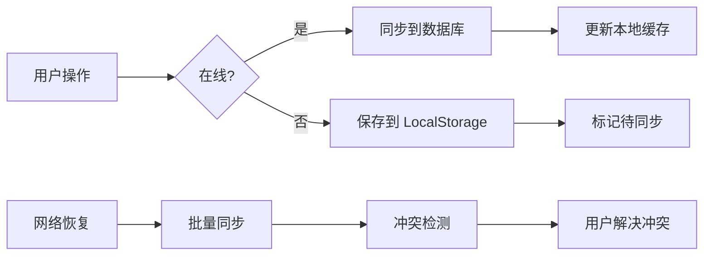

# 开发文档

Ad Fontes Manager 开发者指南

## 开发环境设置

### 前置要求

- Node.js 22 LTS+
- npm 10.0.0+
- PostgreSQL 14+ (可选)
- Git

### 安装步骤

```bash
# 克隆项目
git clone <repository-url>
cd ad-fontes-manager

# 安装后端依赖
cd web
npm install

# 安装前端依赖
cd client
npm install
```

### 启动开发服务器

```bash
# 在 web 目录下
npm run dev
```

这将同时启动：
- 后端服务: http://localhost:8080
- 前端服务: http://localhost:5173

## 项目架构

### 目录结构

```
web/
├── client/                 # Vue 3 前端
│   ├── src/
│   │   ├── components/     # UI 组件
│   │   ├── stores/         # Pinia 状态管理
│   │   ├── utils/          # 工具函数
│   │   └── views/          # 页面视图
│   └── vite.config.ts
├── controllers/            # Express 控制器
├── routes/                 # API 路由
├── services/               # 业务逻辑
├── db/                     # 数据库连接
├── data/                   # 本地数据存储
└── server.ts               # 后端入口
```

### 技术栈

| 层级 | 技术 | 用途 |
|------|------|------|
| 前端框架 | Vue 3 | 响应式 UI |
| 状态管理 | Pinia | 全局状态 |
| 构建工具 | Vite | 快速开发构建 |
| 样式 | Tailwind CSS | 原子化 CSS |
| 后端框架 | Express 5 | REST API |
| 数据库 | PostgreSQL | 主存储 |
| 本地存储 | LocalStorage | 离线缓存 |

## 开发规范

### 代码风格

项目使用 ESLint + Prettier 进行代码规范检查：

```bash
# 检查代码
npm run lint

# 自动修复
npm run lint:fix

# 格式化代码
npm run format
```

### 提交规范

使用 Conventional Commits 规范：

```
<type>(<scope>): <subject>

<body>
```

**类型说明:**

| 类型 | 说明 |
|------|------|
| feat | 新功能 |
| fix | 修复 Bug |
| docs | 文档更新 |
| style | 代码格式（不影响功能） |
| refactor | 重构 |
| perf | 性能优化 |
| test | 测试相关 |
| chore | 构建/工具相关 |

**示例:**

```bash
git commit -m "feat(words): add batch delete functionality"
git commit -m "fix(sync): resolve conflict detection edge case"
git commit -m "docs(api): update endpoint documentation"
```

## 核心功能实现

### 离线优先架构



### 冲突检测流程

1. **保存时检测**: 比较本地版本与数据库版本
2. **Diff 生成**: 使用 deep-diff 库生成差异
3. **用户决策**: 展示冲突界面，选择覆盖或保留
4. **强制更新**: 支持 forceUpdate 参数跳过检测

### 数据流

```
用户输入 (YAML)
    ↓
YAML 解析 (js-yaml)
    ↓
数据验证
    ↓
本地存储 / 数据库存储
    ↓
响应返回
```

## API 开发

### 添加新接口

在 `web/routes/` 目录下创建或修改路由文件：

```typescript
// routes/example.ts
import { Router, Request, Response } from 'express';

const router = Router();

router.get('/example', (req: Request, res: Response) => {
  res.json({ message: 'Hello World' });
});

export default router;
```

在 `server.ts` 中注册路由：

```typescript
import exampleRouter from './routes/example';
app.use('/api/example', exampleRouter);
```

### 控制器模式

```typescript
// controllers/exampleController.ts
import { Request, Response } from 'express';
import * as exampleService from '../services/exampleService';

export const exampleController = {
  async list(req: Request, res: Response) {
    try {
      const data = await exampleService.getList();
      res.json({ success: true, data });
    } catch (e) {
      const error = e as Error;
      res.status(500).json({ success: false, message: error.message });
    }
  }
};

export default exampleController;
```

## 数据库

### Schema 定义

数据库 Schema 定义在 `schema.sql`：

```sql
-- 新增表示例
CREATE TABLE IF NOT EXISTS examples (
  id UUID PRIMARY KEY DEFAULT gen_random_uuid(),
  word_id UUID REFERENCES words(id) ON DELETE CASCADE,
  content TEXT NOT NULL,
  created_at TIMESTAMP DEFAULT CURRENT_TIMESTAMP
);
```

### 连接池配置

```typescript
// db/index.ts
import { Pool } from 'pg';

const pool = new Pool({
  connectionString: process.env.DATABASE_URL,
  max: 20,                    // 最大连接数
  idleTimeoutMillis: 30000,   // 空闲超时
  connectionTimeoutMillis: 5000  // 连接超时
});

export default pool;
```

## 前端开发

### 组件结构

```vue
<!-- components/Example.vue -->
<template>
  <div class="example">
    <h1>{{ title }}</h1>
    <button @click="handleClick">Click</button>
  </div>
</template>

<script setup lang="ts">
import { ref } from 'vue';

const title = ref<string>('Example');

const handleClick = (): void => {
  console.log('Clicked');
};
</script>
```

### Store 模式

```typescript
// stores/exampleStore.ts
import { defineStore } from 'pinia';
import { ref, computed } from 'vue';

interface Item {
  id: string;
  name: string;
}

export const useExampleStore = defineStore('example', () => {
  // State
  const items = ref<Item[]>([]);
  
  // Getters
  const itemCount = computed(() => items.value.length);
  
  // Actions
  const addItem = (item: Item): void => {
    items.value.push(item);
  };
  
  return { items, itemCount, addItem };
});
```

## 调试技巧

### 后端调试

```bash
# 查看详细日志
DEBUG=* npm run dev

# 仅查看应用日志
DEBUG=app:* npm run dev
```

### 前端调试

- 使用 Vue DevTools 浏览器扩展
- Vite 内置 HMR，修改代码自动刷新
- 在 `vite.config.js` 中配置代理

## 测试

### 运行测试

```bash
# 单元测试
npm test

# 端到端测试
npm run test:e2e
```

### 测试结构

```
__tests__/
├── unit/
│   ├── services/
│   └── utils/
└── e2e/
    └── api.test.js
```

## 部署

### 生产环境构建

```bash
# 1. 设置环境变量
export NODE_ENV=production
export DATABASE_URL=<your-db-url>
export ADMIN_TOKEN=<secure-token>

# 2. 构建前端
cd web/client
npm run build

# 3. 启动服务
cd ..
npm start
```

### Docker 部署

```bash
# 构建镜像
docker build -t ad-fontes-manager .

# 运行容器
docker run -p 8080:8080 \
  -e DATABASE_URL=<db-url> \
  -e ADMIN_TOKEN=<token> \
  ad-fontes-manager
```

## 常见问题

### 端口冲突

如果 8080 或 5173 端口被占用：

```bash
# 设置环境变量
export API_PORT=8081
export CLIENT_DEV_PORT=5174
```

### 数据库连接失败

1. 检查 PostgreSQL 服务是否运行
2. 验证 DATABASE_URL 格式
3. 检查防火墙设置

### 前端代理错误

确保后端服务已启动，且 vite.config.js 中的代理配置正确。

## 贡献指南

1. Fork 项目
2. 创建功能分支 (`git checkout -b feature/amazing-feature`)
3. 提交更改 (`git commit -m 'feat: add amazing feature'`)
4. 推送分支 (`git push origin feature/amazing-feature`)
5. 创建 Pull Request

## 资源

- [Vue 3 文档](https://vuejs.org/)
- [Express 文档](https://expressjs.com/)
- [Pinia 文档](https://pinia.vuejs.org/)
- [Tailwind CSS 文档](https://tailwindcss.com/)
